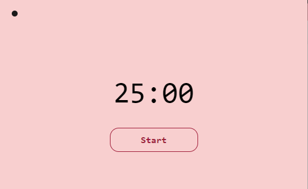

# PomodoroTimer
-> <a href="https://danloose.github.io/PomodoroTimer/" target="_blank">PomodoroTimer</a>   

-> Olá! Este projeto tem o objetivo de criar um timer que simula a técnica do Pomodoro, que consiste em fazer 25 minutos de alguma atividade e pausas de 5 minutos.
Haverá mais especificações sobre a técnica no próprio site, em breve. 

-> O que acontece?  
  - o timer inicia quando o usuário clica em Start.
  - o Dark-Mode pode ser ativado e desativado durante qualquer momento, seja com timer não-iniciado, rodando ou finalizado. Basta clicar na bolinha no canto superior esquerdo.
  - quando o timer chega em 00:00, o navegador manda um alerta avisando o usuário. (Veja o GIF abaixo)
   
-> Futuras Implementações:  
  - Usuário pode alterar o valor do Timer.  
  - Usuário pode pausar e reiniciar o timer quando quiser. 
  - Deixei sua sugestão! 

  
  
